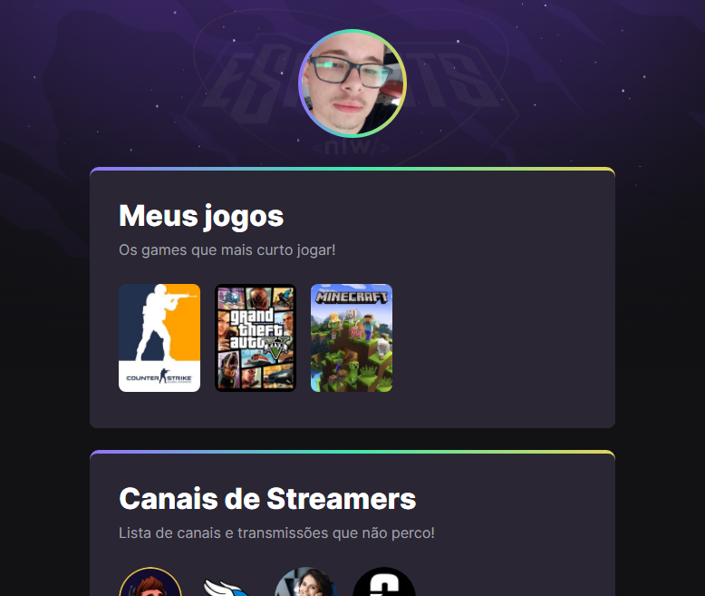

# NLW eSports

> Trilha Explorer

projeto construido no evento New Level Week na RocketSeat.

[Clique aqui e acesse!](https://gabrielf3l1p3.github.io/projeto-nlw)

## Tecnologias
- HTML
- CSS
- Git e GitHub
## Contato
barros990@hotmail.com

## O que é ?
O projeto da trilha explorer é a criação de uma página para mostrar os games e streamers favoritos do criador, com funcionalidades de "ANCORAS" e até "ANIMAÇÕES".